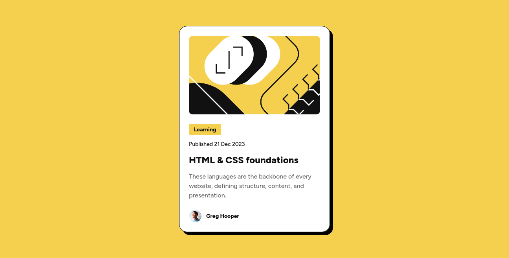

# Frontend Mentor - Blog preview card solution

This is a solution to the [Blog preview card challenge on Frontend Mentor](https://www.frontendmentor.io/challenges/blog-preview-card-ckPaj01IcS).

This project is a solution for the Blog Preview Card challenge on Frontend Mentor. It showcases the use of semantic HTML, modern CSS layout techniques, and responsive design.

## Table of contents

- [Overview](#overview)
  - [The challenge](#the-challenge)
  - [Screenshot](#screenshot)
  - [Links](#links)
- [My process](#my-process)
  - [Built with](#built-with)
  - [What I learned](#what-i-learned)
  - [Continued development](#continued-development)
  - [Useful resources](#useful-resources)
- [Author](#author)
- [How to Run Locally](How-to-Run-Locally)

## Overview

### The challenge

The goal was to design a blog preview card using semantic HTML and advanced CSS techniques. The layout was constructed with Flexbox and CSS Grid to ensure a clean, structured, and adaptable design. A key requirement was implementing a fully responsive interface that adjusts smoothly across different screen sizes and devices.

Additionally, interactive elements such as smooth transitions on text color and shadow effects were created using pseudoclasses like :hover and :focus, enhancing the user experience with subtle animations.

### Screenshot



The screenshot above displays the final design of the blog preview card. It features a clean layout with a header image on top, followed by the article title, a short description, and author information at the bottom. The design adapts seamlessly to different screen sizes, maintaining readability and visual appeal on both desktop and mobile devices.

### Links

- **Solution URL:** [GitHub Repository - Blog preview card](https://github.com/OscarE2D/FrontendMentor-blog-preview-card-main)
- **Live Site URL:** [GitHub Page - Blog preview card](https://oscare2d.github.io/FrontendMentor-blog-preview-card-main/)

## My process

### Built with

- Semantic HTML5 markup
- CSS custom properties
- Flexbox
- CSS Grid
- Mobile-first workflow

### What I learned

During the development of this project, I improved my knowledge in several key areas of web design and development:

**First**, I deepened my understanding of the `clamp()` function. During this stage, I broke down the process for accurately calculating values that give fluidity to HTML elements and text. I was able to apply certain mathematical concepts by formulating an equation that generates those values. To clarify, I did not discover the formula; rather, I explored and adapted it to fit my needs.

**Second**, I strengthened my knowledge of importing fonts from a local source, without the need to install or link to external websites. I noticed that this approach has several advantages, as it avoids reliance on third-party resources. Additionally, I reinforced my understanding of the code structure required to import and use fonts correctly within the CSS file—an important step in my learning process.

**Third**, I significantly improved my understanding of code structuring related to `:hover` and `:focus` transitions. These are valuable tools for applying subtle or prominent animations to HTML and CSS elements. Their main advantage is that they are easy to use and greatly enhance the visual appeal of components.

## **In conclusion**, I consider this stage to have been full of challenges and valuable learning. The use of `clamp()`, transitions, animations, and responsive design contribute to building higher-quality, more fluid, professional, and visually engaging projects. All of this helps provide users with a more personalized and unique experience.

### Continued development

During the application of knowledge and the learning process involved in this project, several topics emerged that require deeper understanding and further development. The most relevant among them are:

**First**, I recognize the need to strengthen my understanding of **pseudo-classes**, **animations**, and **transformations** in CSS. In this regard, I believe it is important to establish a learning plan that will help me consolidate the necessary knowledge on these topics.

**Second**, another area that needs attention is the **organization of CSS code**. To improve in this aspect, I will need to explore resources and literature that guide me toward best practices in code structure.

For now, these are the main areas in which I believe I need to continue deepening my knowledge to strengthen my skills as a developer.

### Useful resources

#### 1. **Git Immersion**

🔗 [https://gitimmersion.com/](https://gitimmersion.com/)
📘 _A practical, step-by-step guide to mastering Git._
This site goes beyond just listing commands — it walks you through practical exercises and real examples. Perfect for understanding not just the "how," but the "why" behind Git.

---

#### 2. **Modern HTML Explained For Beginners** – _by HTML Academy_

🔗 [https://htmlacademy.org/blog/html/semantic-html-guide](https://htmlacademy.org/blog/html/semantic-html-guide)
📘 _Explains how to use semantic HTML in modern development._
Focused on current best practices in HTML5, this guide shows how semantic tags improve SEO, accessibility, and clear structure. Great for strengthening your HTML fundamentals with a modern approach.

---

#### 3. **Every Layout – Intrinsic Design Patterns**

🔗 [https://every-layout.dev/](https://every-layout.dev/)
📘 _Teaches CSS design patterns with a functional and modern approach._
Learn to use tools like `clamp()`, `flex`, `grid`, and other advanced CSS features through a philosophy of simplicity and adaptability — without over-relying on media queries.

---

#### 4. **You Might Not Need JavaScript**

🔗 [https://youmightnotneedjs.com/](https://youmightnotneedjs.com/)
📘 _Shows how many common interactions can be achieved with just HTML and CSS._
A great resource for learning modern attributes and performance techniques. Helps you write simpler, lighter code by reducing unnecessary JavaScript usage.

## Author

- Website - [Oscar Echenique D.](https://github.com/OscarE2D)
- Frontend Mentor - [@OscarE2D](https://www.frontendmentor.io/profile/OscarE2D)

## How to Run Locally

1. Clone the repository:

```bash
git clone https://github.com/OscarE2D/FrontendMentor-blog-preview-card-main
```
